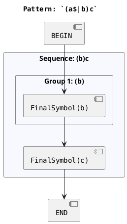

# RgxGen — GraphOptimizer Implementation Specification

> **Branch:** `120.Generate-produces-invalid-strings-when-dollar-and-caret-inside-pattern`
> **Purpose:** Complete, self-sufficient specification for implementing `GraphOptimizer` — a class
> that prunes impossible paths from the `PathGraph` caused by `^` (caret) and `$` (dollar) anchors
> appearing in semantically invalid positions within a pattern.

---

## 1. Project Overview

**RgxGen** is a Java library that parses a regex pattern into a node tree (AST), converts it into a
directed `PathGraph`, then walks that graph to generate matching strings. Core entry point:

```java
RgxGen rgxGen = RgxGen.parse("[^0-9]*[12]?[0-9]{1,2}[^0-9]*");
String s = rgxGen.generate();             // random matching string
String nm = rgxGen.generateNotMatching(); // random non-matching string
StringIterator it = rgxGen.iterateUnique(); // unique values iterator
```

All packages are under `com.github.curiousoddman.rgxgen`.

---

## 2. Architecture

```
regex string
    │
    ▼
DefaultTreeBuilder              (parsing/dflt/DefaultTreeBuilder.java)
    │  parses regex → builds AST Node tree
    ▼
Node tree (DAG)                 (nodes/ package)
    │
    ▼
PathGraphBuilder.build(node)    (lineages/PathGraphBuilder.java)
    │  visits AST → emits PathGraph
    ▼
PathGraph                       (lineages/PathGraph.java)
    │  ← GraphOptimizer operates HERE (not on the AST)
    ▼
[generation visitors]           (visitors/ package)
    │  walk PathGraph, generate output
    ▼
String
```

Key packages:

| Package               | Role                                         |
|-----------------------|----------------------------------------------|
| `rgxgen`              | Entry point: `RgxGen`                        |
| `rgxgen.nodes`        | AST node types                               |
| `rgxgen.lineages`     | `PathGraph`, `PathGraphBuilder`, graph model |
| `rgxgen.parsing.dflt` | Tree builder, parser, constants              |
| `rgxgen.visitors`     | Generation / counting visitors               |
| `rgxgen.optimization` | **To be created** — `GraphOptimizer`         |

---

## 3. AST Node Types

All node classes live in `src/main/java/com/github/curiousoddman/rgxgen/nodes/`.

| Class         | Regex concept                                  | Key API                                      |
|---------------|------------------------------------------------|----------------------------------------------|
| `Node`        | Abstract base                                  | `getPattern()`, `visit(NodeVisitor)`         |
| `FinalSymbol` | Literal character(s): `a`, `abc`, `\t`         | extends `Node`, `LeafNode`                   |
| `Choice`      | Alternation `(a\|b\|c)`                        | `getNodes() → Node[]`                        |
| `Group`       | Capturing group `(...)` / named `(?<n>...)`    | `getNode() → Node`, `getIndex() → int`       |
| `GroupRef`    | Back-reference `\1`                            | extends `Node`, `LeafNode`                   |
| `NotSymbol`   | Negative wrapper                               | extends `Node`, `LeafNode`                   |
| `Repeat`      | Quantifiers `?`, `+`, `*`, `{n}`, `{n,m}`      | `getNode()`, `getMin()`, `getMax()` (-1 = ∞) |
| `SymbolSet`   | Character class `[...]`, `.`, `\d`, `\s`, etc. | extends `Node`, `LeafNode`                   |
| `AnchorNode`  | `^` or `$`                                     | `isCaret()`, `isDollar()`                    |
| `Sequence`    | Ordered sequence of nodes                      | `getNodes() → Node[]`                        |

`LeafNode` is a marker interface. `SingleChildNode` defines `getNode()`. `ArrayChildNode` defines
`getNodes()`.

### `AnchorNode` in detail

```java
public class AnchorNode extends Node implements LeafNode {
    public AnchorNode(char pattern) {
        super(String.valueOf(pattern));
    }

    public boolean isCaret() {
        return getPattern().equals("^");
    }

    public boolean isDollar() {
        return getPattern().equals("$");
    }
}
```

`AnchorNode` is a leaf. It produces no characters during generation. Its presence in an
intermediate position in a sequence makes part of the pattern impossible to generate.

---

## 4. PathGraph Model (the optimizer's input and output)

The `PathGraphBuilder` compiles the AST into a `PathGraph`. The optimizer receives a `PathGraph`
and returns a modified `PathGraph`. All classes are in `com.github.curiousoddman.rgxgen.lineages`.

### 4.1 `PathGraph`

```java
public class PathGraph {
    public PathGraph(String pattern) { ...}

    public void addNode(PathNode node) { ...}

    public void addEdge(PathEdge edge) { ...}

    public void addRootCluster(PathGraphCluster cluster) { ...}

    public List<PathNode> getNodes() { ...}        // unmodifiable

    public List<PathEdge> getEdges() { ...}        // unmodifiable

    // getters for rootClusters not yet public — optimizer may need to add one
    public String toPlantUml() { ...}
}
```

`toPlantUml()` produces the PlantUML diagram string that the tests compare against the `.puml`
resource files.

### 4.2 `PathNode`

```java
public class PathNode {
    public enum Kind {AST, BEGIN, END, REPEAT_ENTRY, CHOICE}

    // Factories:
    public static PathNode forAst(Node astNode, int seq)

    public static PathNode begin(int seq)

    public static PathNode end(int seq)

    public static PathNode repeatEntry(Repeat repeat, int seq)

    public static PathNode choice(Choice choice, int seq)

    public String getId()    // e.g. "AST_0", "BEGIN_5", "CHOICE_1"

    public Kind getKind()

    public String getLabel() // human-readable; used verbatim in PlantUML output
}
```

IDs are constructed as `Kind.name() + "_" + sequenceNumber`. Labels for `AST` nodes are:
`ClassName(escapedPattern)` — e.g. `FinalSymbol(a)`, `AnchorNode(^)`.

The `Util.plantumlEscape(String)` method is used to escape labels:

```java
public static String plantumlEscape(String s) {
    return s.replace("\"", "\\\"").replace("\n", "\\n");
}
```

### 4.3 `PathEdge`

```java
public record PathEdge(PathNode from, PathNode to, int min, int max) {
    public static final int UNBOUNDED = -1;

    public static PathEdge once(PathNode from, PathNode to)              // min=1, max=1

    public static PathEdge repeat(PathNode from, PathNode to, int min, int max)

    public String label()  // "" for once; "N" for exact; "N..M" for range; "N..<&infinity>" for unbounded
}
```

### 4.4 `PathGraphCluster`

Clusters group nodes visually into nested `rectangle` blocks in PlantUML. Every compound AST node
(Sequence, Choice, Repeat, Group) produces one cluster.

```java
public class PathGraphCluster {
    public PathGraphCluster(String label) { ...}

    public void addDirectNode(String nodeId) { ...}

    public void addChild(PathGraphCluster child) { ...}

    public Set<String> getDirectNodeIds() { ...}

    public List<PathGraphCluster> getChildren() { ...}

    public String getLabel() { ...}
}
```

### 4.5 `Fragment`

Used internally by `PathGraphBuilder` during construction (not needed by the optimizer directly):

```java
public record Fragment(List<PathNode> entries, List<PathNode> exits, List<PathEdge> internalEdges) {
    public static Fragment terminal(PathNode node) { ...}
}
```

### 4.6 How `PathGraphBuilder` builds the graph

`PathGraphBuilder` implements `NodeVisitor` and uses a fragment stack. Key behaviors:

- **BEGIN / END** sentinels are synthetic `PathNode`s added *after* all clusters are built. They
  are never members of any cluster.
- **`AnchorNode`** is treated as a terminal (`pushTerminal`) — it becomes an `AST`-kind `PathNode`
  with label `AnchorNode(^)` or `AnchorNode($)`.
- **`Choice`** creates a synthetic `CHOICE` node that fans out to each alternative's entries.
- **`Repeat`** creates a synthetic `REPEAT_ENTRY` node. It connects to the body with
  `PathEdge.repeat(repeatEntry, bodyEntry, min, max)` and back-edges from body exits to
  `repeatEntry` with `PathEdge.once(bodyExit, repeatEntry)`. The repeat entry is both the entry
  *and* exit of the repeat fragment (exit = zero-iterations path).
- **`Group`** is transparent — it opens a cluster for visual grouping but does not introduce a
  synthetic node. Its child's fragment is left on the stack unchanged.
- **`Sequence`** chains child fragments left-to-right with `PathEdge.once` edges.

---

## 5. The Core Problem

The library currently **ignores `^` and `$`** during generation; `AnchorNode.visit()` in
`GenerationVisitor` is a no-op. When anchors appear inside alternations, the parser still builds
all branches — including branches that are **semantically impossible** at generation time.

### Worked example: `(a$|b)c`

After `PathGraphBuilder`, the unoptimized graph has these logical paths:

```
Path 1:  BEGIN → Choice → AnchorNode($) ... wait, no.
```

More precisely — the parser for `(a$|b)c` builds:

- A `Choice` with two alternatives: a `Sequence[a, $]` and a `FinalSymbol(b)`
- Followed by `FinalSymbol(c)`

So the PathGraph (before optimization) contains paths:

```
Path 1:  BEGIN → CHOICE → AnchorNode($) → FinalSymbol(c) → END   [via 'a' then '$']
Path 2:  BEGIN → CHOICE → FinalSymbol(b) → FinalSymbol(c) → END
```

Wait — the `AnchorNode($)` is an `AST` node in the graph. The actual layout (using the
`PathGraphBuilder` rules) is:

```
BEGIN → CHOICE_node → AST[FinalSymbol(a)] → AST[AnchorNode($)] → AST[FinalSymbol(c)] → END
                    → AST[FinalSymbol(b)] ─────────────────────────────────────────────→ END
```

**Path 1 is impossible.** `$` asserts end-of-string; `FinalSymbol(c)` cannot follow it. Generating
from Path 1 produces `"ac"` which does NOT match `(a$|b)c`. This is the bug.

### Anchor semantics in the graph

| Anchor | Meaning                | Constraint on graph position                            |
|--------|------------------------|---------------------------------------------------------|
| `^`    | Assert start-of-string | May only be preceded by BEGIN (no real nodes before it) |
| `$`    | Assert end-of-string   | May only be succeeded by END (no real nodes after it)   |

A path is **impossible** when either condition is violated:

1. An `AST[AnchorNode($)]` node has any successor other than `END`.
2. An `AST[AnchorNode(^)]` node has any predecessor other than `BEGIN`.

---

## 6. Expected Optimizer Output: Complete Test Case Catalogue

The tests are driven by the enum `DollarAndCaretPatterns` (in
`src/test/java/.../data/DollarAndCaretPatterns.java`). Each enum constant defines:

- The regex pattern
- The list of all unique values the optimized pattern can generate
- A `.puml` file path at `testdata/dollar-and-caret/<ENUM_NAME>.puml`

The test (`GraphOptimizationTests.parseTest`) calls:

```java
RgxGen parse = RgxGen.parse(testPattern.getPattern());
String pathGraph = parse.getPathGraph().toPlantUml();

assertEquals(testPattern.getOptimizedGraph(), pathGraph);
```

So `RgxGen.getPathGraph()` must return the **optimized** graph. The optimizer must run as part of
`RgxGen` construction (after `PathGraphBuilder.build()`).

### 6.1 Complete enum listing (as of the current source)

```java
DEAD_BRANCH_DOLLAR("(a$|b)c",List.of("bc"))
LIVE_BRANCH_DOLLAR("c(a$|b)",List.of("ca", "cb"))
LIVE_BRANCH_CARET("(^a|b)c",List.of("ac", "bc"))
DEAD_BRANCH_CARET("c(a|^b)",List.of("ca"))
DEAD_BRANCH_CARET_DOLLAR("(^a$|b)c",List.of("bc"))
ALL_DEAD_BRANCHES("x(a$|^b)c",List.of())
LIVE_BRANCHES_REPEAT_DOLLAR("(1$|1,){0,1}(2$|2,){0,1}",List.of("1","1,","1,2","1,2,","2","2,"))
LIVE_BRANCHES_REPEAT_CARET("(^1|1,){0,1}(^2|2,){0,1}",List.of("1","1,","1,2","1,2,","2","2,"))
DEAD_BRANCHES_REPEAT_DOLLAR("(1$|1,){0,1}(2$|2,)",List.of("1,2","2","2,"))
DEAD_BRANCHES_REPEAT_CARET("(^1|1,)(^2|2,){0,1}",List.of("1","1,","1,2,","2,"))
LIVEDEAD_REPEAT_CARET("(^a)+",List.of("a"))
LIVEDEAD_REPEAT_DOLLAR("(b$)*",List.of("", "b"))
DEAD_ON_REPEAT_CARET("(a|^x){1,2}",List.of("a", "x","aa"))
DEAD_ON_REPEAT_DOLLAR("(a$|x){1,2}",List.of("a", "x","xx"))
DEAD_ON_REPEAT_WITHOUT_REPEAT_DOLLAR("(a$|x){2,2}",List.of("xa", "xx"))  
LIVE_DOUBLE_START("^(a|^b)",List.of("a", "b"))
LIVE_DOUBLE_END("(a$|b)$",List.of("a", "b"))
```

### 6.2 Case-by-case expected behaviour

#### `DEAD_BRANCH_DOLLAR` — `(a$|b)c`

- Alternative `a$` is dead: `$` is followed by `c`.
- Alternative `b` survives.
- Result: `Choice` and `Group` containers are stripped down to a simple `Sequence: (b)c`.
- `FinalSymbol(b)` and `FinalSymbol(c)` are the only content nodes.
- Unique values: `["bc"]`

#### `LIVE_BRANCH_DOLLAR` — `c(a$|b)`

- Alternative `a$` is live: `$` is the last thing in the sequence, nothing follows.
- Both alternatives survive. The `$` `AnchorNode` is removed from the graph.
- Unique values: `["ca", "cb"]`

#### `LIVE_BRANCH_CARET` — `(^a|b)c`

- Alternative `^a` is live: `^` is at the very beginning.
- Both alternatives survive. The `^` `AnchorNode` is removed from the graph.
- Unique values: `["ac", "bc"]`

#### `DEAD_BRANCH_CARET` — `c(a|^b)`

- Alternative `^b` is dead: `^` has `c` before it.
- Alternative `a` survives. Result: `Sequence: c(a)` with only `FinalSymbol(a)` in `Group 1`.
- Unique values: `["ca"]`

#### `DEAD_BRANCH_CARET_DOLLAR` — `(^a$|b)c`

- Alternative `^a$` is dead: even though `^` and `$` are both present, `$` is followed by `c`.
- Alternative `b` survives.
- Result: `Sequence: (b)c`.
- Unique values: `["bc"]`

#### `ALL_DEAD_BRANCHES` — `x(a$|^b)c`

- Alternative `a$`: `$` is followed by `c` — dead.
- Alternative `^b`: `^` is preceded by `x` — dead.
- Both alternatives dead → entire pattern produces nothing.
- Result graph: `BEGIN → END` only (no content nodes, no clusters).
- Unique values: `[]`
- This case must throw `PatternDoesNotMatchAnythingException`
  (`com.github.curiousoddman.rgxgen.parsing.dflt.PatternDoesNotMatchAnythingException`) at
  generation time, or the graph is left as BEGIN→END and generation returns nothing.

#### `LIVE_BRANCHES_REPEAT_DOLLAR` — `(1$|1,){0,1}(2$|2,){0,1}`

- `1$` is live: the repeat is optional (`{0,1}`), so if chosen, `1$` can be the last thing.
  But `1$` cannot be followed by `(2$|2,)`. The dollar-terminated alternative `1$` must wire
  directly to `END` and skip the second group.
- `1,` can be followed by anything (second group, or end).
- `2$` is live when it is last.
- `2,` is live always.
- The optimizer keeps all alternatives but rewires the dollar-terminated ones directly to `END`.
  All `$` `AnchorNode`s are removed from the graph.
- Unique values: `["1","1,","1,2","1,2,","2","2,"]`

#### `LIVE_BRANCHES_REPEAT_CARET` — `(^1|1,){0,1}(^2|2,){0,1}`

- `^1` is live in the first group (it can be at start).
- `^2` in the second group: `^` is only valid at the very beginning. If the first group generates
  something, `^2` is preceded by content — dead in that context. But the first group is `{0,1}`,
  so it may generate nothing, making `^2` still valid at start.
- The optimizer keeps both anchored alternatives; all `^` `AnchorNode`s are removed from the graph.
- Unique values: `["1","1,","1,2","1,2,","2","2,"]`

#### `DEAD_BRANCHES_REPEAT_DOLLAR` — `(1$|1,){0,1}(2$|2,)`

- First group: `1$` cannot be followed by the mandatory second group — dead. Only `1,` survives.
  The first group becomes `(1,){0,1}`.
- Second group: `2$` is at the end — live. `2,` is also live.
- The `$` `AnchorNode` for `2$` is removed from the graph.
- Unique values: `["1,2","2","2,"]`

#### `DEAD_BRANCHES_REPEAT_CARET` — `(^1|1,)(^2|2,){0,1}`

- First group (mandatory): `^1` is live at start; `1,` is also live.
  The `^` `AnchorNode` for `^1` is removed from the graph.
- Second group (optional): `^2` is dead — always preceded by the first group's output.
  Only `2,` survives. The second group becomes `(2,){0,1}`.
- Unique values: `["1","1,","1,2,","2,"]`

#### `LIVEDEAD_REPEAT_CARET` — `(^a)+`

- `^a` in a repeat: first iteration is valid (at start), but the back-edge makes a second
  iteration invalid (`^` is now preceded by `a`).
- The repeat collapses to exactly one occurrence. The `Repeat` node is removed entirely from the
  graph; only `FinalSymbol(a)` remains between `BEGIN` and `END`. The `^` `AnchorNode` is removed.
- Unique values: `["a"]`

#### `LIVEDEAD_REPEAT_DOLLAR` — `(b$)*`

- `b$` in a repeat: one iteration is valid (at end), but iteration back makes a second
  iteration invalid (`b` after `$`).
- The repeat bounds change from `{0,∞}` to `{0,1}`. The structure is kept but `max` is clamped
  to 1. The `$` `AnchorNode` is removed from the graph.
- Unique values: `["", "b"]`

#### `DEAD_ON_REPEAT_CARET` — `(a|^x){1,2}`

- First iteration: both `a` and `^x` are valid. `^` is at start.
- Second iteration: `^x` is dead (preceded by first iteration output).
- The optimizer splits the structure: the first iteration uses `Choice(a|^x)`, and subsequent
  iterations only allow `a`. The result is:
  `begin → Choice(a|^x) → [a or x] → Repeat(a){0,1} → end`
  The `^` `AnchorNode` is removed; `x` is reachable only on the first pass.
- Unique values: `["a","x","aa"]`

#### `DEAD_ON_REPEAT_DOLLAR` — `(a$|x){1,2}`

- First iteration: both `a$` and `x` are valid if `a$` terminates.
- Second iteration: `a$` is dead (followed by another iteration), only `x` survives for
  non-terminal passes.
- The dollar-terminated alternative `a$` can only fire on the **last** iteration.
- Structure: `Repeat(a$|x){1,2}` where `a` (from the dollar alternative) connects directly to
  `END`, bypassing further repetitions, and `x` feeds back into the repeat. The repeat remains
  `{1,2}`. The `$` `AnchorNode` is removed from the graph.
- Unique values: `["a","x","xx"]`

#### `DEAD_ON_REPEAT_WITHOUT_REPEAT_DOLLAR` — `(a$|x){2,2}` 

- Exactly 2 repetitions are required (`min=2, max=2`).
- On any non-final iteration, `a$` is dead because another iteration always follows — `$` cannot
  be succeeded by more content.
- On the final (last) iteration, both `a$` and `x` are valid since the last iteration exits to
  `END`.
- The optimizer therefore **splits the repeat**: the first `{n−1}` iterations (`{1,1}` here) can
  only choose `x`, while the last iteration can choose either `a` or `x`.
- Result structure:
  ```
  BEGIN → Repeat(x){1,1} → Choice(a|x) → END
  ```
  i.e., one mandatory `x`, followed by a final choice of `a` or `x`.
- The `$` `AnchorNode` is removed from the graph.
- Unique values: `["xa", "xx"]`

#### `LIVE_DOUBLE_START` — `^(a|^b)`

- Outer `^` is at start — valid.
- Inner `^b` alternative: the inner `^` is redundant (already at start) but not invalid.
  Both `a` and `b` can be generated.
- Both alternatives survive. Inner `^` `AnchorNode` is removed from the graph.
- Unique values: `["a","b"]`

#### `LIVE_DOUBLE_END` — `(a$|b)$`

- Outer `$` is at end — valid.
- Inner `a$` alternative: inner `$` is followed by outer `$`, which is also at end — valid.
  Both `a` and `b` can be generated.
- Both alternatives survive. Inner `$` `AnchorNode` is removed from the graph.
- Unique values: `["a","b"]`

---

## 7. Implementation Plan

### 7.1 New class: `GraphOptimizer`

**Package:** `com.github.curiousoddman.rgxgen.optimization`
**File:** `src/main/java/com/github/curiousoddman/rgxgen/optimization/GraphOptimizer.java`

The optimizer receives a `PathGraph` (already built by `PathGraphBuilder`) and returns a new or
mutated `PathGraph` with impossible anchor paths removed and `AnchorNode` graph nodes eliminated.

```java
package com.github.curiousoddman.rgxgen.optimization;

import com.github.curiousoddman.rgxgen.lineages.PathGraph;
import com.github.curiousoddman.rgxgen.nodes.Node;

public class GraphOptimizer {

    /**
     * Optimize the PathGraph by removing impossible paths caused by ^ and $ anchor
     * nodes appearing in semantically invalid positions. AnchorNode PathNodes are
     * removed from the graph entirely; no label annotation is applied to adjacent nodes.
     *
     * @param graph the PathGraph produced by PathGraphBuilder
     * @return the optimized PathGraph (may be the same instance mutated, or a new one)
     */
    public PathGraph optimize(PathGraph graph) { ...}
}
```

### 7.2 Integrate into `RgxGen`

Modify `RgxGen` constructor to run the optimizer after building the graph:

```java
// In RgxGen constructor (RgxGen.java):
node =defaultTreeBuilder.

get();

PathGraph rawGraph = PathGraphBuilder.build(node);
pathGraph =new

GraphOptimizer().

optimize(rawGraph);
```

`RgxGen.getPathGraph()` already exists and returns `this.pathGraph`.

### 7.3 Algorithm

The optimizer must handle three distinct sub-problems:

#### Sub-problem 1: Simple dead-branch removal in Choice

**Input pattern:** `(a$|b)c` — `a$` is followed by `c`, so that branch is dead.

**Algorithm:**

1. Traverse the PathGraph. For each `AnchorNode($)` AST node:
    - Find its successors in the graph.
    - If any successor is not `END`, the path containing this `$` is impossible.
2. For each `AnchorNode(^)` AST node:
    - Find its predecessors in the graph.
    - If any predecessor is not `BEGIN`, the path containing this `^` is impossible.
3. Trace each impossible anchor back to the `CHOICE` node it belongs to (if any).
4. Remove the dead alternative from the `Choice`'s fan-out edges.
5. If all alternatives of a `Choice` are removed, propagate the death upward.
6. Remove the anchor `PathNode` itself from the graph (along with all its edges).

#### Sub-problem 2: Repeat with anchored alternatives

**Input patterns:** `(a$|x){1,2}`, `(^a)+`, `(b$)*`

The key insight: **an anchor-containing alternative can only fire on the first (`^`) or last (`$`)
iteration of a repeat.** For other iterations, it is dead.

**Algorithm for `$` inside repeat:**

- `(a$|x){min,max}`: `a$` can only be chosen on the final iteration (nothing follows).
    - In the PathGraph, the `$`-terminated path's exit must go directly to `END`, not back to
      `REPEAT_ENTRY`.
    - The back-edge from the dollar-terminated node to `REPEAT_ENTRY` is removed.
    - The edge from the dollar-terminated node to `END` is added (if not already present via
      normal flow).
    - If `max` is unbounded (∞) or strictly greater than the minimum mandatory count, this is valid.
    - If the dollar alternative is the **only** one (no other exit from REPEAT_ENTRY goes back),
      then max is clamped to 1.

**Algorithm for `^` inside repeat:**

- `(^a)+`: `^a` can only fire on the first iteration.
    - On the first iteration (entry from `BEGIN`), `^a` is valid.
    - On subsequent iterations (re-entry from the back-edge), `^a` is dead.
    - Remove the back-edge from the caret-terminated node to `REPEAT_ENTRY`.
    - If only caret alternatives exist (no non-caret alternative can loop), the repeat effectively
      runs at most once. Remove the `REPEAT_ENTRY` node entirely; connect `BEGIN` directly to the
      body node.
    - Adjust `REPEAT_ENTRY` bounds accordingly.

**Clamping rules:**

| Pattern        | Before       | After                                         |
|----------------|--------------|-----------------------------------------------|
| `(^a)+`        | min=1, max=∞ | Repeat removed; exactly one `a`               |
| `(b$)*`        | min=0, max=∞ | min=0, max=1                                  |
| `(a$\|x){1,2}` | min=1, max=2 | `a$` exits to END on any iteration; `x` loops |
| `(a$\|x){2,2}` | min=2, max=2 | Split: `x{1,1}` then final `Choice(a\|x)`     |

#### Sub-problem 3: Cascading death

When a dead branch causes an entire `Choice` to die, the death propagates to the parent. If the
parent is a `Repeat`, the repeat must be removed. If the parent is a `Sequence`, the sequence
itself is impossible, which may cascade further upward.

**Algorithm:**

- After removing dead alternatives, check if any `CHOICE` node has zero outgoing edges.
- If so, mark the `CHOICE` node as dead.
- Propagate: any node whose only predecessor is a dead node is also dead.
- If `BEGIN` can no longer reach `END`, the graph represents a pattern that matches nothing.
- In this case, simplify to `BEGIN → END` and ensure generation throws
  `PatternDoesNotMatchAnythingException`.

### 7.4 Cluster label updates

When a `Choice` loses an alternative (e.g., `(a$|b)c` → only `b` survives), the cluster
hierarchy must also be updated. Specifically:

- The `PathGraphCluster` whose label includes the original pattern (e.g., `"Choice: (a$|b)"`)
  should have its label updated to reflect the optimized pattern (e.g., `"Choice: (b)"` — though
  checking the puml files, the labels in surviving structures appear to be rewritten to reflect
  only the remaining content).
- Cluster label updates are visible in the expected `.puml` files. For example,
  `DEAD_BRANCHES_REPEAT_DOLLAR` shows:

  ```
  rectangle "Sequence: (1,){0,1}(2$|2,)" {
  ```
  — the `(1$|1,)` part became `(1,)` because `1$` was pruned.

This means cluster labels must be recomputed from the surviving nodes after optimization, or the
optimizer must update them to match. The simplest approach is to recompute labels by walking the
surviving AST structure; alternatively, the optimizer can build a fresh `PathGraph` from the
pruned AST.

---

## 8. Files to Create / Modify

| File                                                                                 | Action                                                                           |
|--------------------------------------------------------------------------------------|----------------------------------------------------------------------------------|
| `src/main/java/com/github/curiousoddman/rgxgen/optimization/GraphOptimizer.java`     | **Create** — main optimizer class                                                |
| `src/main/java/com/github/curiousoddman/rgxgen/RgxGen.java`                          | **Modify** — run optimizer after `PathGraphBuilder.build()`                      |
| `src/main/java/com/github/curiousoddman/rgxgen/lineages/PathGraph.java`              | **Modify** — expose `getRootClusters()` and node/edge mutation methods if needed |
| `src/test/java/com/github/curiousoddman/rgxgen/lineages/GraphOptimizationTests.java` | **Already exists** — verify all enum cases pass                                  |
| `src/test/java/com/github/curiousoddman/rgxgen/data/DollarAndCaretPatterns.java`     | **Already exists** — update `DEAD_ON_REPEAT_WIHTOUT_REPEAT_DOLLAR` values        |
| `testdata/dollar-and-caret/LIVE_DOUBLE_START.puml`                                   | **Already exists** — verify content matches optimizer output                     |
| `testdata/dollar-and-caret/LIVE_DOUBLE_END.puml`                                     | **Already exists** — verify content matches optimizer output                     |

---

## 9. Test Infrastructure

### Test class

```
src/test/java/com/github/curiousoddman/rgxgen/lineages/GraphOptimizationTests.java
```

```java
public class GraphOptimizationTests {
    public static Stream<DollarAndCaretPatterns> getPatterns() {
        return Arrays.stream(DollarAndCaretPatterns.values());
    }

    @ParameterizedTest
    @MethodSource("getPatterns")
    public void parseTest(DollarAndCaretPatterns testPattern) throws IOException {
        RgxGen parse = RgxGen.parse(testPattern.getPattern());
        String pathGraph = parse.getPathGraph().toPlantUml();

        try {
            assertEquals(testPattern.getOptimizedGraph(), pathGraph);
        } catch (AssertionFailedError e) {
            // On failure, writes the actual output to the expected file for comparison
            Path expectedFilePath = testPattern.getExpectedFilePath();
            Files.writeString(expectedFilePath, pathGraph);
            throw e;
        }

        // Also validates that unique value generation matches expected list
        Spliterator<String> tSpliterator =
                Spliterators.spliteratorUnknownSize(parse.iterateUnique(), 0);
        List<String> list = StreamSupport.stream(tSpliterator, false).toList();
        assertEquals(testPattern.getAllUniqueValues(), list);
    }
}
```

The test has two assertions:

1. `toPlantUml()` output matches the `.puml` file exactly (character-for-character).
2. `iterateUnique()` returns exactly the expected list of unique values.

### How `.puml` files are bootstrapped

`DollarAndCaretPatterns` constructor reads the `.puml` file; if it does not exist it calls
`RgxGen.parse(pattern).getPathGraph().toPlantUml()` and writes it. All 17 enum constants now have
corresponding `.puml` files in `testdata/dollar-and-caret/`.

### Expected `.puml` resource files

```
testdata/dollar-and-caret/<ENUM_NAME>.puml
```

All 17 files exist — one per enum constant. The PlantUML format (full example — `DEAD_BRANCH_DOLLAR`,
pattern `(a$|b)c`):



Observations from this format:

- The title block uses the **original** pattern string (before optimization).
- `BEGIN` and `END` sentinels are declared as top-level `component` entries (outside all clusters).
- Clusters are `rectangle` blocks, potentially nested.
- Node aliases use the form `node_<KIND>_<seq>`.
- Sequence numbers in node aliases reflect the AST build order — these are stable across runs for
  the same pattern.
- A trailing `}` appears before `@enduml` — this is part of the existing `toPlantUml()` output.

---

## 10. Anchor Rules Summary

```
VALID positions:
  BEGIN → [content] → END                  ← baseline
  BEGIN → ^ → [content] → END              ← ^ at start is valid
  BEGIN → [content] → $ → END              ← $ at end is valid
  BEGIN → ^ → [content] → $ → END          ← both anchors valid

INVALID positions (must be pruned):
  BEGIN → [content] → $ → [more content] → END    ← $ not at end
  BEGIN → [content] → ^ → [content] → END         ← ^ not at start

In a repeat context:
  (^x)+       → ^ valid only on first iteration; collapse to exactly 1 occurrence (repeat removed)
  (x$)*       → $ valid only on last iteration; clamp max to 1
  (a$|x){1,2} → a$ can exit to END on any iteration; x loops back
  (a$|x){2,2} → split: first (n-1) iterations allow only x; last iteration allows Choice(a|x)

In all cases:
  AnchorNode is removed from the graph after optimization.
  No label annotation is applied to adjacent nodes.
```

---

## 11. Edge Cases and Decisions

| Case                   | Decision                                                                                                                                                      |
|------------------------|---------------------------------------------------------------------------------------------------------------------------------------------------------------|
| `(a$\|b$)x`            | Both alternatives have `$` before `x`. Entire pattern is invalid → throw `PatternDoesNotMatchAnythingException`.                                              |
| `^(a\|^b)`             | Outer `^` at start. Inner `^b`: inner `^` is redundant (already at start) but valid. Both `a` and `b` survive. Inner `^` `AnchorNode` removed from graph.     |
| `(a$\|b)$`             | Outer `$` at end. Inner `a$`: inner `$` followed by outer `$` — valid (both at end). Both survive. Inner `$` `AnchorNode` removed from graph.                 |
| `(a$)?b`               | Equivalent to `(a$){0,1}b`. With 1 occurrence, `$` is followed by `b` — dead. With 0 occurrences, `b` is fine. → Remove the `a$` body entirely; treat as `b`. |
| `(a$\|)b`              | The empty alternative makes one path valid. Keep the empty branch; remove `a$`.                                                                               |
| Multi-line mode `(?m)` | Not in scope. Ignore. `^` and `$` are treated as string-boundary anchors only.                                                                                |
| `\b` and `\B`          | Not in scope. Leave as-is.                                                                                                                                    |

---

## 12. PlantUML Node Label Format Reference

Node labels in the optimized graph follow this convention (derived from `PathNode` factories):

| PathNode kind  | Label format                | Example                          |
|----------------|-----------------------------|----------------------------------|
| `AST`          | `ClassName(escapedPattern)` | `FinalSymbol(a)`, `SymbolSet(.)` |
| `BEGIN`        | `BEGIN`                     | —                                |
| `END`          | `END`                       | —                                |
| `CHOICE`       | `Choice(escapedPattern)`    | `Choice((^a\|b))`                |
| `REPEAT_ENTRY` | `Repeat(escapedPattern)`    | `Repeat((b$)*)`                  |

`AnchorNode` `PathNode`s are removed from the graph by the optimizer and do not appear in the
final output. No label annotation is applied to adjacent nodes.

`escapedPattern` = `Util.plantumlEscape(node.getPattern())`, which escapes `"` and `\n`.

The `component` declaration in PlantUML wraps the label in triple-quotes:

```
component """<label>""" as node_<ID>
```

For `CHOICE` and `REPEAT_ENTRY` nodes, a stereotype is appended:

```
component """Choice((a|b))""" as node_CHOICE_1 <<choice>>
component """Repeat((a)+)""" as node_REPEAT_ENTRY_0 <<repeat>>
```

---

*Specification prepared for branch `#120.Generate-produces-invalid-strings-when-dollar-and-caret-inside-pattern`.*
*All class and method signatures verified against source files in `src/main/java/`.*
*All test cases and expected behaviours cross-referenced against `DollarAndCaretPatterns.java` and the `.puml` resource
files.*